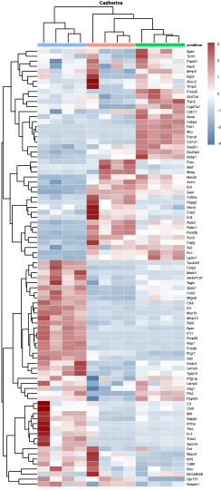

# Nice Plots

### GO_plots.R: 
#### represent EnrichR enrichment results as dotplots or barplots with ggplot. In a cluster-profiler style but without cluster profiler.

### Heatmap.R: 
#### a simple code to make heatmaps with Pheatmap library + function to convert gene names from human to mouse.

